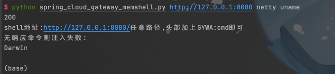

# CVE-2022-22947 memshell
###此脚本不完善,仅作学习用途,请勿非法使用


基于 [c0ny1](https://gv7.me/articles/2022/the-spring-cloud-gateway-inject-memshell-through-spel-expressions/)
大佬的博客做的学习脚本,可写入netty和spring内存马.

测试环境为 [vulhub](https://github.com/vulhub/vulhub/tree/master/spring/CVE-2022-22947)

```
eg:xx.py http://127.0.0.1:8080 netty whoami
```



